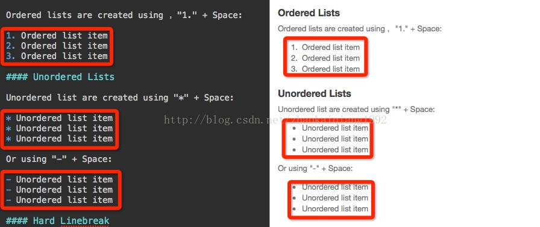

# Add image
 
 
# Highlight
*强调* 或者 _强调_  (示例：斜体)
**加重强调** 或者 __加重强调__ (示例：粗体)
***特别强调*** 或者 ___特别强调___ (示例：粗斜体)

# Newline
在需要换行的地方输入至少两个空格，然后回车即可.
此处需要换行  
。

# Link
[Markdown](http://blog.csdn.net/zhaokaiqiang1992)

# Order a list
 
